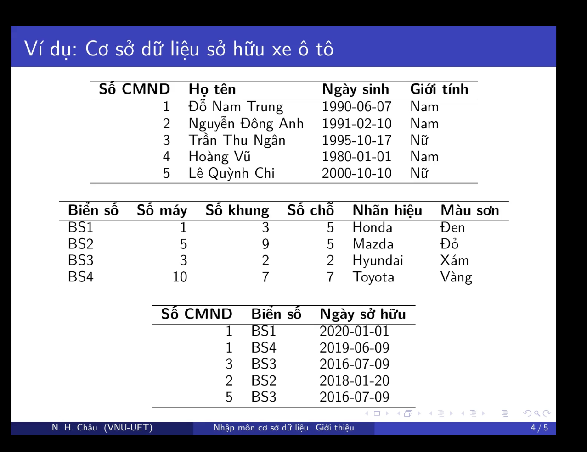

# Cơ sở dữ liệu

## 1. Định nghĩa

- Là một tập hợp dữ liệu có liên quan với nhau , được lưu trữ trên máy tính , có nhiều người sử dụng và được tổ chức theo mô hình
- Là hệ thống các thông tin có cấu trúc , được lưu trữ thông tin thứ cấp như băng từ , đĩa từ

```
Ví Dụ :

NHANVIEN : thông tin về nhân viên
DUAN : thông tin về dự án
PHONGBAN : thông tin về phòng ban
```



### Các tính chất của cơ sở dữ liệu (CSDL)

- Một CSDL biểu thị một khía cạnh nào đó của thế giới thực.Thông tin được đưa vào trong CSDL tạo thành không gian CSDL hoặc một "thế giới nhỏ"
- Một CSDL được thiết kế và được phổ biến cho một mục đích riêng
- Một CSDL là một tập hợp dữ liệu liên kết với nhau một cách logic và mang một ý nghĩa nào đó
- Một cơ sở dữ liệu không phải một tập hợp dữ liệu tuỳ tiện

### Ưu điểm

1. Giảm trùng lập thông tin dưới mức thấp nhất đảm bảo tính nhất quán và toàn vẹn dữ liệu
2. Đảm bảo dữ liệu được truy vấn ở nhiều cách khác nhau
3. Khả năng chia sẻ thông tin cho nhiêu người

# Hệ quản trị cơ sở dữ liệu

## Định nghĩa

- Một **hệ quản trị cở sở dữ liệu** (Database management system - DBMS) là tập hợp các chương trình giúp cho người dùng tạo ra và duy trì khai tác CSDL một cách dễ dàng thực hiện một số công việc

```
- Định nghĩa CSDL : Đặc tả các kiểu dữ liệu , các cấu trúc và các ràng buộc

- Xây dựng CSDL : là quá trình lưu trữ dữ liệu trên các phương tiên lưu trữ được hệ quản trị CSDL kiểm soát

- Thao tác trên CSDL : truy vấn CSDL , cập nhật dữ liệu và tạo ra các báo cáo

- Các hệ quản trị CSDL có thể là phổ thông và chuyên dụng

Các DBMS thông dụng : SQL server , Oracle ,..
```

## Một hệ quản trị dữ liệu phải có các yếu tố sau:

1. Ngôn ngữ giao tiếp giữa người dùng và hệ quản trị dữ liệu (SQL, QBE...) :

   - Ngôn ngữ mô tả dữ liệu (DDL - Data Definition Language) : cho phép khai báo cấu trúc CSDL , các mỗi liên hệ của dữ liệu , các quy định ràng buộc dữ liệu
   - Ngôn ngữ thao tác dữ liệu (DML - Data Manipulation Language) : cho phép thực hiện tao tác thêm , sửa , xóa dữ liệu
   - Ngôn ngữ truy vấn có cấu trúc (SQL - Structured Query Language) : cho phép người khai thác sử dụng để truy vấn thông tin cần thiết
   - Ngôn ngữ quản lí dữ liệu (DCL - Data Control Language) : cho phép thay đổi cấu trúc bảng , khai báo bảo mật , cấp quyền cho người sử dụng

2. Từ điển dữ liệu (Data Dictionary) :
   - Dùng để mô tả các ánh xạ liên kết
   - Ghi nhận các thành phần cấu trúc của CSDL , các CT ứng dụng , mật mã , quyền hạn sử dụng

## Chức năng của một hệ quản trị cơ sở dữ liệu

1. Lưu trữ các định nghĩa , các mối liên kết dữ liệu (gọi là siêu dữ liêu - metadata)
2. Tạo ra các cấu trúc phức tạp theo yêu cầu để lưu trữ dữ liệu
3. Biển đổi các dữ liệu được nhập vào để phù hợp với các cấu trúc dữ liệu ở trên
4. Tạo ra hệ thông bảo mật và áp đặt tính bảo mật và riêng tư trong cơ sở dữ liệu
5. Tạo ra các cấu trúc phức tạp cho phép nhiều người sử dụng truy cập đến dữ liệu
6. Cung cấp các thủ tục sao lưu và phực hồi dữ liệu để đảm bảo sự an toàn và toàn vẹn dữ liệu
7. Thực hiện các quy tắc an toàn để đảm bảo sự an toàn và toàn vẹn dữ liệu
8. Cung cấp việc truy cập dữ liệu thông qua một ngôn ngữ truy vấn
