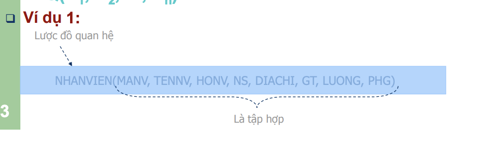

# Mô hình và lược đồ cơ sở dữ liệu

## Định nghĩa

> Một mô hình cơ sở dữ liệu được định nghĩa là tập hợp các khái niệm và các ràng buộc liên quan đến việc tổ chức và quản lý dữ liệu trong một hệ thống thông tin. Nó là một mô tả lý thuyết về các đối tượng, các mối quan hệ giữa các đối tượng và các ràng buộc của các đối tượng đó trong một lĩnh vực nào đó.

## Các loại mô hình trong cơ sở dữ liệu

1.  Mô hình logic dựa trên cơ sở mẫu tin

    - Mô hình dữ liệu phân cấp (Hierarchical)
    - Mô hình dữ liệu mạng (Network)

      > Là một mô hình biễu diễn bởi những mẫu tin (record) , loại mẫu tin , loại liên hệ giữa các mẫu tin và bản số mẫu tin
      > **Mẫu tin** : là một mô tả đối tượng trong thế giới thực.Ví dụ : "Nguyễn Văn A sẽ có các thông tin như tuổi , tên , họ , ... và mỗi sinh viên chính là Mẫu tin"
      > **Loại mẫu tin** : chính là tên của đối tượng.Ví dụ CONNGUOI là một loại mẫu tin.Để thể hiện một loại mẫu tin ta dùng kí hiệu dưới đây thể hiện
      > 
      >
      > **Loại liên hệ** : Mô tả liên hệ giữa các mẫu tin. Ví dụ mỗi sinh viên sẽ học trong 1 lớp , 1 lớp có nhiều sinh viên học. Được kí hiệu như ở dưới
      >
      > 
      >
      > **Bản số** : chỉ ra số lượng mẫu tin tham gia trong mối liên hệ
      >
      > - (1 : 1)(one - to - one ) : Mỗi 1 mẫu tin của loại mẫu tin chủ kết hợp với đúng 1 mẫu tin của loại mẫu tin thành viên
      > - (1 : n)(one - to - many) : Mỗi mẫy tin của loại mẫu tin kết hợp với 1 hoặc nhiêu mẫu tin thành viên
      > - (n : 1)(many - to - one ) : Nhiều mẫu tin của loại mẫu tin chủ kết hợp với những 1 mẫu tin của loại thành viên
      > - (Recursive) : một loại mẫu tin chủ cũng có thể đồng thời là loại mẫu tin thành viên với chính nó
      >
      > 
      >
      > **Giải thích**
      > Mỗi phòng có nhiều nhân viên (n) và mỗi nhân viên chỉ thuộc một phòng (1), vậy đây là mối quan hệ (1-n)
      > Mỗi nhân viên có một lý lịch (1) và mỗi lý lịch thuộc về một nhân viên (1), đây là quan hệ (1-1)
      > Mỗi nhân viên làm nhiều công việc (n) và mỗi công việc có một nhân viên (1) làm, đây là mối quan hệ (n-1)
      > Môi nhân viên sẽ có một người quản lý trực tiếp (trưởng nhóm), và mỗi nhóm có thể có nhiều nhân viên, đây là mối quan hệ (Recursive) vì nó tự chỉ đến nó

    - Mô hình dữ liệu quan hệ (Relational)
      > Mô hình dữ liệu quan hệ là mô hình thể hiện mối quan hệ về mặt dữ liệu trong một đối tượng hoặc giữa các đối tượng với nhau
      > Sử dụng các phép toán như giao , hợp , tích đề các , chia ,trừ , kết nối , chọn ... để xấy dựng mối quan hệ
      > Bao gồm một hoặc nhiều mối quan hệ
      > Thực thể và thuộc tính trong mô hình ERD (Mô hình dữ liệu thực thể - kết hợp) trở thành thuộc tính của quan hệ
      > **I.Các khái niệm trong mô hình dữ liệu quan hệ**
      >
      > **1. Quan hệ(Bảng)**
      >
      > - Hay được gọi là bảng
      > - Một quan hệ được biểu diễn dưới dạng **bảng** .Trong đó 1 **dòng** trong bảng tương đương với một **bộ** , một **cột** trong bảng tương đương với một **thuộc tính** của quan hệ
      > - **Bậc** của một quan hệ là số các thuộc tính trong quan hệ
      > - **Lực lượng** của một quan hệ là số các bộ trong quan hệ
      > - **Cấu trúc của một quan hệ** : là tập hợp các thuộc tính tạo nên quan hệ đó
      >   **2. Thuộc tính (Attribute)**
      >
      > - Một thuộc tính không có giá trị hoặc chưa xác định được gán với giá trị **Null**
      > - là các đặc tính của một đối tượng
      > - là một cột trong table hay còn gọi là trường
      > - Mỗi thuộc tính được xác định trên một miền giá trị nhất định được gọi là **miền giá trị**
      > - Kí hiệu miền giá trị : Dom(attribute) = ('nam' , 'nu')
      > - Ví dụ : SinhVien(MaSV , tenSV , namSinh) --> dom(MaSV) = {char(50)}
      > - 
      >
      > **3. Bộ (Tuple)**
      >
      > - Bộ là các dòng của quan hệ (Trừ dòng tiêu đề : tên của các thuộc tính )
      > - Thể hiện dữ liệu cụ thể của các thuộc tính trong quan hệ
      > - Một bộ của quan hệ Q(A1 , A2 , An) là q=(a1 , a2 , an) với a(i) thuộc Dom(ai)
      > - 
      > - 
      >
      > **4. Thể hiện của quan hệ (Instance)(Thực thể)**
      >
      > - Thể hiện của một quan hệ là tập hợp các bộ giá trị của quan hệ tại một thời điểm nhất định ( Tức là số lượng các record trong một thời điểm )
      > - Ký hiệu : thể hiện của quan hệ Q là TQ
      > - Ví dụ : 
      >
      > **5. Tân từ**
      >
      > - Tân từ là một quy tắc dùng để mô tả một quan hệ
      > - Ký hiệu : ||Q||
      > - Ví dụ : THI(maSv , maMH , lanThi , Diem)
      >   ||THI|| : mỗi sinh viên được phép thi môn học nhiều lần , mỗi lần thi một môn học nhiều lần , mỗi lần thi lưu trữ sinh viên nào thi môn gì , lần thì thứ mấy và điểm là bao nhiêu
      >
      > **6. Lược đồ quan hệ**
      >
      > - **Mục đích** : mô tả cấu trúc của một quan hệ và các mối liên hệ giữa các thuộc tính trong quan hệ đó
      > - **Một lược đồ quan hệ gồm** : Một tập thuộc tính của quan hệ và một mô tả để xác định ý nghĩa giữa các thuộc tính
      >
      > - **Lược đồ quan hệ** được đặc trưng bởi : Một tên phân biệt và một tập hữu hạn các thuộc tính (A1 , A2)
      > - **Ký hiệu** : Lược đồ quan hệ Q gồm n thuộc tính (A1 , A2 , An) là : **Q(A1 , A2 , An)**
      > - **Ví dụ :** 
      >
      > **7. Lược đồ cơ sở dữ liệu**
      >
      > - là tập hợp của các lược đồ quan hệ liên quan đến nhau. Nó mô tả toàn bộ cấu trúc lưu trữ dữ liệu
      >
      > - **Ví dụ** 
      >
      > **8. Tóm tắt các ký hiệu**
      >
      > 
      >
      > **II. Ràng buộc (constraint)**
      >
      > **Các loại khoá**
      >
      > 1. Siêu khoá (Super key)
      >
      > - là tập hợp con của các thuộc tính mà giá trị của chúng có thể phân biệt 2 bộ khác nhau trong cùng 1 thể hiện **TQ** bất kì
      > - là một tập hợp của một hoặc nhiều hơn một khoá có thể xác định một bản ghi duy nhất trong một mảng
      > - Ví dụ : t1 , t2 thuộc tập hợp TQ , t1[K] và t2[K] là khác nhau thì K là siêu khoá của Q
      > - Một quan hệ có ít nhất một siêu khoá (Q+) và có thể có nhiều siêu khoá
      > - Ví dụ : 
      >
      > 2. Khoá chính (Primary key)
      >    - Một môi quan hệ chỉ được khai báo một khoá chính
      >    - Khoá chính được dùng để định danh mỗi record trong bảng duy nhất của CSDL
      >    - Khoá chính được kí hiệu **#** khi vẽ mô hình quan hệ
      > 3. Khoá ngoại (Foregin Key)
      >    - Khoá ngoại của một bảng được xem như là con trỏ tới khoá chính của bảng khác
      >    - Kết nối 2 bảng với nhau
      >    - Khoá ngoại được kí hiệu là dấu @

2.  Mô hình logic dữ trên cơ sở đối tượng

    - Mô hình dữ liệu thực thể - kết hợp

    > **Mô hình thực thể - liên kết(Entity Relationship - ER)**
    > là một mô hình dữ liệu mức quan niệm nhằm mô tả các đối tượng trong thế giới thực và quan hệ giữa chúng
    > **Thực thể** là một đối tượng trong thế giới thực , có sự tồn tại độc lập
    >
    > - **Thực thể cụ thể** : có thể cảm nhận được bằng giác quan , ví dụ xe đạp , bàn ghế , cốc nước, ...
    > - **Thực thể trừu tượng** : Không thể cảm nhận bằng giác quan nhưng có ý nghĩa trong thế giới thực , ví dụ như khái niệm, ý tưởng, sự kiện, ...
    >
    > **I. Các khái niệm trong mô hình thực thể - liên kết**
    >
    > **1. Thuộc tính**
    >
    > - là các đặc trưng cụ thể mô tả thực thể. Ví dụ tên , tuổi , nơi ở,...
    >
    > **Phân loại các thuộc tính**
    >
    > - **Thuộc tính đơn** : là các thuộc tính không thể phân chia ra được thành các thành phần nhỏ hơn
    > - **Thuộc tính phức hợp** : là thuộc tính có thể phân chia được thành các thành phần nhỏ hơn , biểu diênx các thuộc tính cơ bản hơn với các ý nghĩa độc lập . Ví dụ : họ và tên , địa chỉ nhà
    > - **Thuộc tính đơn trị** : Những thuộc tính có giá trị duy nhất cho một thực thể cụ thể . Ví dụ : màu tóc
    > - **Thuộc tính đa trị** : Một thuộc tính có thể có một tập giá trị cho cùng một thực thể. Ví dụ : một phòng ban có thể nhận nhiều dự án
    > - **Thuộc tính suy diễn được** : là thuộc tính có giá trị có thể tính được thông qua giá trị của các thuộc tính khác . Ví dụ : tuổi được tính từ năm sinh , điểm trung bình được tính từ các điểm khác
    >
    > - **Thuộc tính khoá** : là thuộc tính mà giá trị của nó là duy nhất cho mỗi thực thể , giúp phân biệt thực thể này với thực thể khác trong cùng 1 kiểu thực thể
    >
    > - **Ví dụ**
    > - 
    > - 
    >
    > **2. Thực thể**
    >
    > - **Kiểu thực thể** là tập hợp các thực thể có thuộc tính giống nhau được mô tả bằng tên và các thuộc tính . Ví dụ : NHANVIEN(Họ tên , Tuổi , Lương) là một kiểu thực thể
    > - **Tập thực thể** là một tập hợp các thực thể của một kiểu thực thể trong cơ sở dữ liệu tại một thời điểm bất kì
    >
    > **Các kiểu thực thể**
    >
    > - **Thực thể mạnh** : Tồn tài độc lập với các kiểu thực thể khác
    >   Ký hiệu : hình chữ nhật
    >   Ví dụ : 
    > - **Thực thể yếu** : Tồn tại phụ thuộc vào kiểu thực thể khác
    >   Ký hiệu : hình chữ nhật có 1 viền bên ngoài bao bọc
    >   Ví dụ : 
    >
    > **3. Liên kết và các ràng buộc**
    >
    > - dùng để chỉ mối quan hệ giữa 2 hoặc nhiều thực thể với nhau , được biết diễn bằng hình thoi
    > - dùng **động từ để biểu diễn sự liên kết**
    > - 
    > - **Bậc của liên kết** là số thực thể tham gia vào liên kết
    > - Bậc 1 : Kiếu liên kết bậc 1 là mối quan hệ giữa cùng một thực thể
    > - Bậc 2 : Kiểu liên kết bậc 2 là mối quan hệ giữa 2 thực thể.Ví dụ : HocSinh thuộc về Lop
    > - Bậc 3 : Kiểu liên kết bậc 3 là mối liên quan giữa 3 kiểu thực thể.Ví dụ : DonHang , CuaHang , NguoiMua
    >   **Ràng buộc liên kết gồm :**
    > - **Liên kết quan hệ 1-1**:
    >   là mối quan hệ mà mỗi bản ghi trong thực thể E1 chỉ có nhiều nhất một bản ghi được liên kết trong thực thể E2
    >   **Ví dụ** : Mối quan hệ giữa thực thể NhanVien và LyLich
    >    > **Ví dụ thể hiện liên kết** 
    >
    > - **Liên kết quan hệ 1-N**:
    >   là mối quan hệ mà một bản ghi trong thực thể E1 có thể không liên kết hoặc liên kết với một hay nhiều bản ghi trong thực thể E2
    >   **Ví dụ** : Mối quan hệ giữa PhongBan và NhanVien , KhachHang va SanPham
    >   
    >   Hoặc cũng có thể ký hiệu
    >   
    > - **Liên kết quan hệ N-M**:
    >   là mối quan hệ mà một bản ghi trong thực thể có thể liên kết với nhiều bản ghi khác trong thực thể khác và ngược lại
    >   **Ví dụ** : Mối quan hệ giữa DuAn và NhanVien. Một nhân viên có thể tham gia nhiều dự án và một dự án tham gia bởi nhiều nhân viên
    >   
    > - **Lực lượng của mối liên kết**:
    >   là số bản ghi lớn nhất và nhỏ nhất của thực thể tham gia vào liên kết
    >   **Ký hiệu**
    >   ta thêm (min , max) vào mối liên kết
    >   **min** : là số bản ghi nhỏ nhất tham gia vào liên kết
    >   **max**. : là số bản ghi lớn nhất tham gia vào liên kết
    >   Mặc định : min = 0 , max = n
    >   =>>>> XÁC ĐỊNH LỰC LƯỢNG NÀY TỪ KHẢO SÁT THỰC TẾ BÀI TOÁN
    > - Thuộc tính của liên kết / quan hệ
    >   Mối liên kết cũng có các thuộc tính riêng của chúng
    >   **Ví dụ** : Trong mối quan hệ giữa DUAN và NHANVIEN có thuộc tính thời gian bắt đầu và kết thúc khi tham gia từng dự án , đây là hai thuộc tính của mối liên kết
    >    > <u>Chú ý</u> : Để đơn giản hoá đôi khi trình bày các thuộc tính nằm trong các thực thể
    >
    >   **Thuộc tính hay Thực thể?**
    >   Với một phần tử dữ liệu , để khẳng định nó là thuộc tính hay thực thể cần có các câu trả lời sau
    >
    > - Có thuộc tính riêng hay không?
    > - Có liên kết với thực thể khác hay không , dạng liên kết như thế nào?
    >   **<u>Khi đó</u>**
    >
    > - Nếu không có thuộc tính riêng và liên kết 1-1 thì nên xem nó là thuộc tính
    > - Nếu có thuộc tính riêng là liên kết 1 - nhiều hoặc nhiều nhiều thì xem nó là thực thể
    >
    > **4. Tổng quát hoá và chuyên việt hoá**
    >
    > - **Tổng quát hoá**: là xem một thực thể nào đó là con của một thực thể khác tổng quát hơn. Ví dụ : Sach là môt loại con của loại tổng quát hơn là TAILIEU chung
    > - **Ví dụ** : Ta có kiểu thực thể là UserPremium và UserGold . 2 Loại user này có các thuộc tính chung như HoTen , DiaChi .UserPremium sẽ có các thuộc tính riêng noAds , prioritize và UserGold có các thuộc tính download , storage
    > - 
    > - **Chuyên biệt hoá** : là khái niệm ngược lại với tổng quát hoá. Chuyên biệt hoá là xem một thực thể là con của một thực thể cụ thể hơn. Ví dụ: SachGiaoKhoa là một loại Sach , Oto là một loại PhuongTienDiChuyen
    > - **Các kiểu ràng buộc trong liên kết mở rộng**
    > - **Ràng buộc rời rạc hoàn toàn** : Một thực thể con chỉ thuộc về một thực thể tổng quan và không thuộc về bất kì thực thể tổng quan nào khác
    > - **Ví dụ** : Trong xã hội loài người có một thực thể ConNguoi và có 2 kiểu thực thể con là NguoiGiau và NguoiNgheo, con người chỉ có NguoiGiau và NguoiNgheo
    > - **Ràng buộc rời rạc không hoàn toàn** : Một thực thể con thuộc về nhiều thực thể tổng quan và có thể chia sẻ một số thông tin của thực thể tổng quan
    > - **Ví dụ** : Trong bối cảnh có 1 kiểu thực thể PhuongTien . một phương tiện có thể là xe máy hoặc ô tô

    - Mô hình dữ liệu hướng đối tượng , phân tán , ...

3.  Mô hình vật lí
