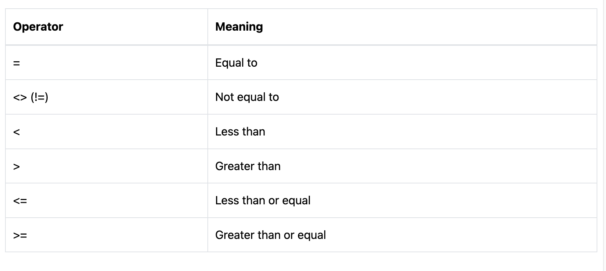
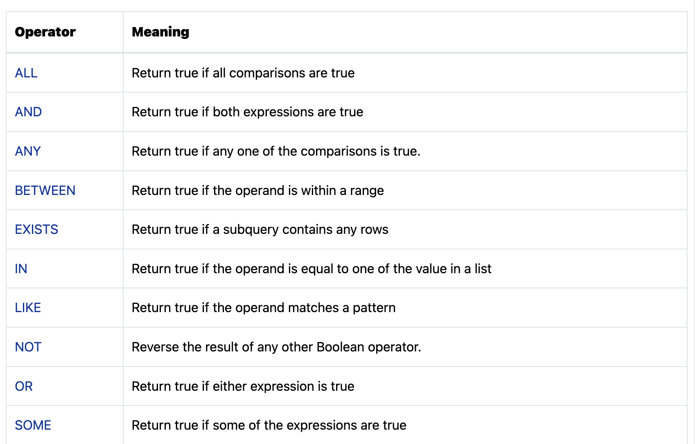
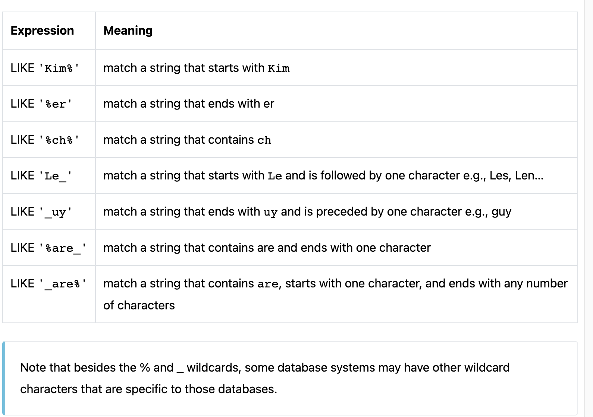

## SELECT

- SELECT là từ khóa được sử dụng để lấy dữ liệu từ 1 hoặc nhiều bảng.

```
SELECT
    select_list
FROM
    table_name;
```

#### 1. SELECT tất cả dữ liệu từ 1 bảng

- Khi xử lý câu lệnh **SELECT** , câu lệnh **FROM** sẽ được thực hiện trước sau đó đến câu lệnh **SELECT**
- Lấy ra tất cả dữ liệu trong table ta sử dụng câu lệnh sau

```
SELECT * FROM employess;
```

- Trong lập trình tránh sử dụng câu lệnh `SELECT * FROM`.Bởi vì có thể ứng dụng của bạn có thể không cần sử dụng những dữ liệu mà bạn lấy ra và điều đó sẽ gây cho ứng dụng của bạn bị chậm khi xử lí dữ liệu

#### 2. SELECT dữ liệu từ một hoặc nhiều cột cụ thể trong bảng

- Có thể lấy ra dữ liệu từ 1 cột cụ thể trong bảng , cần chỉ định các cột sau câu lệnh `SELECT`

```
SELECT
	employee_id , first_name , last_name
FROM employees;
```

#### 3. SELECT thực hiện 1 phép tính toán

- Sử dụng `SELECT` lấy ra first name , last name , salary , new salary

```
SELECT
	employee_id ,
	first_name ,
	last_name ,
	salary ,
	salary * 1.05
FROM employees;
```

- `salary * 1.05` sẽ được thêm vào tất cả các employee. Mặc định của SQL sử dụng biếu thức là tiêu để của một cốt
- Có thể gán 1 cột hoặc một tên với tên khác. Sử dụng từ khoá **AS**

```
SELECT
	employee_id ,
	first_name ,
	last_name ,
	salary ,
	salary * 1.05 AS new_salary
FROM employees;
```

## ORDER BY

- `ORDER BY ` là một lựa chọn của `SELECT`. `ORDER BY` là mệnh đề cho phép bạn sắp xếp kết quả đã được trả về từ `SELECT`

```
SELECT
    select_list
FROM
    table_name
ORDER BY
    sort_expression [ASC | DESC];
```

- Giải thích :
- Thứ nhất , đặt mệnh đề `ORDER BY` sau `FROM`. Cơ sở dữ liệu sẽ được thực hiện như sau : `FROM` > `SELECT` > `ORDER BY`
- Thứ 2 , chỉ định một biếu thức sắp xếp sau mệnh để `ORDER BY`
- Thứ 3 , sử dụng `ASC` để sắp xếp tăng dần hoặc `DESC` để sắp xếp giảm dần
- `ORDER BY` mặc định sử dụng `ASC`

- Có thể sử dụng nhiều biều thức để sắp xếp

```
SELECT
    select_list
FROM
    table_name
ORDER BY
    sort_expression_1 [ASC | DESC],
    sort_expression_2 [ASC | DESC];
```

- Giải thích
- Đầu tiên sẽ nhận được kết quả từ sắp xếp từ sort_expression_1
- Thứ 2 , sort_expression sẽ được sắp xếp dự vào kết quả của sort_express_1

#### 1. Sử dụng mệnh đề ORDER BY để sắp xếp kết quả 1 cột

```
SELECT
	employee_id ,
	first_name
FROM
	employees
ORDER BY
	first_name;
```

## DISTINCT

- Xoá các dòng trùng lập từ kết quả `SELECT`

```
SELECT DISTINCT
    column1, column2, ...
FROM
    table1;
```

- Về hiệu năng có thể làm tăng thời gian truy vấn , vì cơ sở dữ liệu sẽ kiểm tra sự trùng lặp của các cột . Nếu dữ liệu lớn sẽ bị ảnh hưởng đến hiệu năng ứng dụng

## LIMIT & OFF SET

- Giới hạn số lượng record trả về

```
SELECT
    column_list
FROM
    table1
ORDER BY column_list
LIMIT row_count OFFSET offset;
```

- Giải thích
- row_count xác định số lượng record trả về
- `OFF SET` sẽ bỏ qua các row offset trước khi trả về kết quả
- `OFF SET` sẽ là tuỳ chọn. Nếu không có `OFF SET` câu truy vấn sễ lấy số lượng row đầu tiên khi có kết quả trả về từ `SELECT `
- Khi sử dụng `LIMIT` cần sử dụng `ORDER BY `

## SQL FETCH

- `OFFSET FETCH` hoạt động như `LIMIT`. Bỏ qua N số dòng đầu tiên của kết quả

```
OFFSET offset_rows { ROW | ROWS }
FETCH { FIRST | NEXT } [ fetch_rows ] { ROW | ROWS } ONLY
```

- Mysql không hỗ trợ syntax này
- **PostgreSQL 10+, và Microsoft SQL Server 2012+ hỗ trợ**

## SQL WHERE

- Lấy ra kết quả từ điều kiện cụ thể

```
SELECT
    column1, column2, ...
FROM
    table_name
WHERE
    condition;
```

- `WHERE` được áp dụng ngay lập tức sau mệnh đề `FROM`
- `WHERE` chứa một hoặc nhiều hơn biểu thức logic. Nếu biếu thức **True** thì sẽ được thêm vào kết quả và ngược lai **False** sẽ bị loại trừ
- Các toán tử được sử dụng trong SQL :
- 

#### 1. SQL WHERE với so sánh số học

```
SELECT
	employee_id , first_name , last_name , salary
FROM
	employees
WHERE
	salary > 10000
ORDER BY
	salary DESC;
```

- Tìm kiếm tất cả employee với salary lớn hơn 10000 và sắp xếp giảm dần kết quả nhận được

#### 2. SQL WHERE với ký tự

```
SELECT
	employee_id  , first_name  , last_name
FROM
	employees
WHERE
	last_name = 'King';
```

- Tìm kiếm tất cả employee với last_name = 'King'

#### 3. SQL với date

```
SELECT
	employee_id,
	first_name,
	last_name,
	hire_date
FROM
	employees
WHERE
	hire_date >= '1999-01-01'
ORDER BY
	hire_date DESC;
```

- Tìm kiếm tất cả employee với hire_data lớn hơn hoặc bằng '1999-01-01' và sắp xếp theo thứ tự giảm dần

- Sử dụng `YEAR` function để lấy ra năm của hire_date

```
SELECT
	employee_id  , first_name  , last_name , hire_date
FROM
	employees
WHERE
	YEAR(hire_date) = '1999';
```

- Sử dụng `AND` để sử dụng 2 biểu thức

```
SELECT
	employee_id  , first_name  , last_name , hire_date
FROM
	employees
WHERE
	YEAR(hire_date) = '1999'
AND
	first_name = 'Diana';
```

- Sử dụng `BETWEEN` cùng với `WHERE`

```
SELECT
	employee_id  , first_name  , last_name , salary
FROM
	employees
WHERE
	 salary BETWEEN  2500 AND 2900;
```

## SQL LOGICAL OPERATORS

- Sử dụng để kiểm tra tính đúng đẵn của một điều kiện trả về true , false hoặc unknown
- 

#### 1. AND

- cho phép xây dựng nhiều điêu kiện trong mệnh đề `WHERE` của một câu lệnh SQL

```
SELECT
    first_name, last_name, salary
FROM
    employees
WHERE
    salary > 5000 AND salary < 7000
ORDER BY salary;
```

#### 2. OR

- Cho phép xây dựng nhiều điều kiện trong mệnh đề `WHERE`
- Tuy nhiên `OR` sẽ trả về true nếu 1 điều kiện là true

```
SELECT
	employee_id  , first_name  , last_name , salary
FROM
	employees
WHERE
		salary = 7000 OR salary = 8000;
```

- Sử dụng OR kết hợp với AND
- Khi sử dụng `OR` và `AND` thì `AND` có mức độ thực thi ưu tiên cao hơn
- Khi câu truy vẫn sử dụng nhiều `OR` , câu truy vấn sẽ trở lên khó đọc. Có thể sử dụng `IN`

```
SELECT
	employee_id  , first_name  , last_name , salary  , hire_date
FROM
	employees
WHERE
	salary = 9000
AND
	YEAR(hire_date) = '1990'
OR
	YEAR(hire_date)  = '1994'
ORDER BY
	salary DESC;

```

- Ví dụ sử dụng `IN`

```
SELECT
	employee_id  , first_name  , last_name , salary  , hire_date , YEAR (hire_date)  as time_at
FROM
	employees
WHERE
	salary = 9000
OR
	YEAR(hire_date) IN (1990,1994)
ORDER BY
	salary DESC;
```

#### 3.IS NULL

- Kiểm tra kết quả NULL , nếu NULL trả về true và ngược lại nếu không NULL trả về false
- Là một giá trị đặc biệt SQL
- `NULl` chỉ ra những dữ liệu không xác định , không thể áp dụng được và không tồn tại
- Không thể sử dụng toán tử so sánh gái trị với `NULL`

```
SELECT
	employee_id  , first_name  , phone_number
FROM
	employees
WHERE
	phone_number IS NULL ;
```

- Sử dụng `IS NOT NULL` để kiểm tra cột đố không có giá trị `NULL`

#### 4. BETWEEN

- Kiểm tra giá trị trong 1 khoảng giá trị

```
expression BETWEEN low AND high;
Tương đương với : expression >= low AND expression <= high


SELECT DISTINCT
	employee_id , first_name  , salary
FROM
	employees
WHERE
	salary BETWEEN 2500 AND 2900
ORDER BY
	salary DESC;
```

- Để kiểm tra giá trị không nằm trong 1 nhất định. Ta sử dụng `NOT BETWEEN`

```
expression NOT BETWEEN low AND high
Tương đương với : expression < low OR expression > high

SELECT
	employee_id  , last_name , salary
FROM
	employees
WHERE
	salary NOT BETWEEN 2500 AND 2900
ORDER BY
	salary DESC;
```

#### 5. EXITS

- Kiểm tra truy vấn con có giá trị trả về hay không

```
EXISTS (subquery)
```

- Nếu subquery trả về kết quả thì `EXISTS` trả về true
- `EXISTS` sẽ kết thúc quá trình ngay lập tức khi tìm thấy 1 row
- Bạn có thể sử dụng `EXISTS` để cải thiện hiệu năng của câu truy vấn

```
SELECT
	employee_id  , first_name , last_name
FROM
	employees
WHERE
	EXISTS (
		SELECT
			1
		FROM
			dependents
		WHERE
			dependents.employee_id = employees.employee_id
	);

```

- `NOT EXITS` ngược lại với `EXISTS`. Kiểm tra truy vấn con không trả về kết quả thì sẽ trả về true

```
SELECT
	employee_id  , first_name  , last_name
FROM
	employees
WHERE
	NOT EXISTS (
		SELECT
			1
		FROM
			dependents
		WHERE
			dependents.employee_id = employees.employee_id
	);
```

- Nếu truy vấn con trả về `NULL` thì `EXISTS` sẽ trả về true. `EXITS` sẽ chỉ kiểm tra tìm thấy dữ liệu hay chưa, không quan tâm đến giá trị `NULL`

#### 6. IN

- Kiểm tra xem giá trị của một biểu thức có nằm trong danh sách các giá trị

  ```
  expression IN (value1,value2,...)

  SELECT
  	employee_id , first_name , last_name  , job_id
  FROM
  	employees
  WHERE
  	job_id IN (8,9,10)
  ORDER BY
  	job_id DESC;
  ```

- Có thể thay thể cho toán tử OR khi kiểm tra nhiều giá trị

- `NOT IN` trả về true nếu giá trị của biểu thức không nằm trong danh sách

```
SELECT
	employee_id , first_name  , last_name , job_id
FROM
	employees
WHERE
	job_id NOT IN (7,8,9)
ORDER BY
	job_id DESC;
```

- Sử dụng `IN` với truy vấn con để kết hợp 2 câu truy vấn đơn

```
SELECT
    employee_id, first_name, last_name, salary
FROM
    employees
WHERE
    department_id IN (SELECT
            department_id
        FROM
            departments
        WHERE
            department_name = 'Marketing'
                OR department_name = 'Sales')
```

#### 7. LIKE

- Kiểm tra chuỗi có khớp với mẫu (pattern) sử dụng ký tự đại diện % hoặc \_

```
expression LIKE pattern
```

- `%` đại diện cho 0 hoặc nhiều ký tự bất kỳ
- `_%` đại diện cho chính xác 1 ký tự bất kỳ
- Ví dụ: 

- `NOT LIKE` kiểm tra chuỗi không khớp với mẫu.

#### 8. ANY

- Sử dụng để so sánh một giá trị với tập hợp các giá trị trong một truy vấn con.
- Trước toán tử ANY phải có toán tử so sánh >, >=, <, <=, =, <> và theo sau là truy vấn con

```
WHERE column_name comparison_operator ANY (subquery)
```

- Nếu truy vấn con không trả về hàng nào thì điều kiện sẽ đánh giá sai sẽ trả về **false**
- 

```
SELECT
	employee_id  , last_name , department_id , salary
FROM
	employees
WHERE
	salary  = ANY(
		SELECT
		 	AVG(salary)
		FROM
			employees
		GROUP BY
			department_id
		)
ORDER BY
	salary DESC;
```

#### 9. ALL

- So sánh giá trị với tất cả các kết quả trả về của truy vấn con thay vì một kết quả bất kỳ.
- Nếu đúng hết với điều kiện so sánh thì mới trả về true, ngược lại trả về false.
- Trước toán tử ALL phải có toán tử so sánh >, >=, <, <=, =, <> và theo sau là truy vấn con

```
WHERE column_name comparison_operator ALL (subquery)
```
